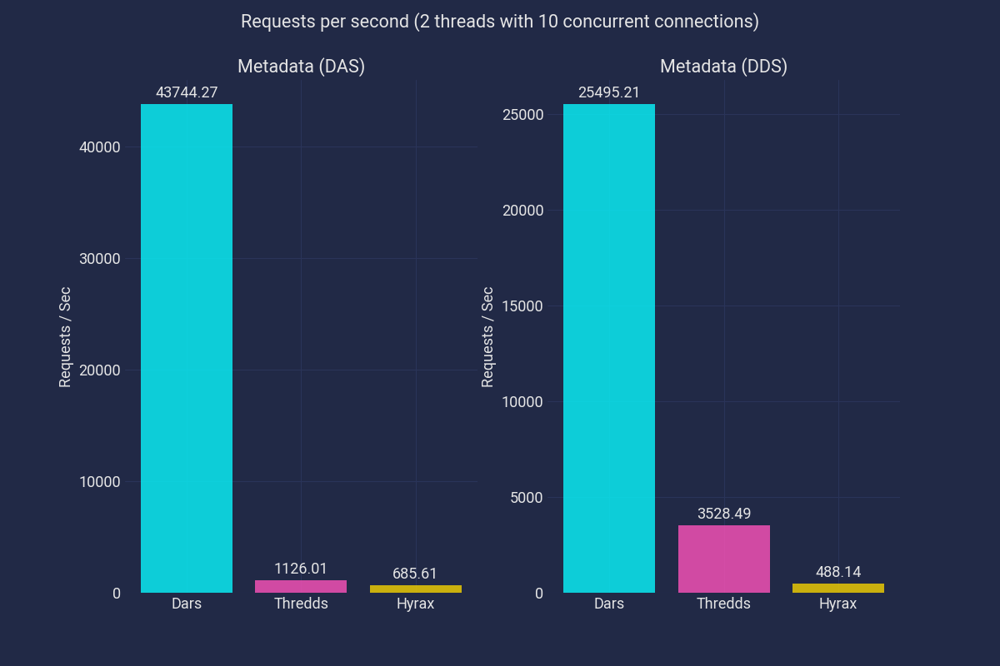
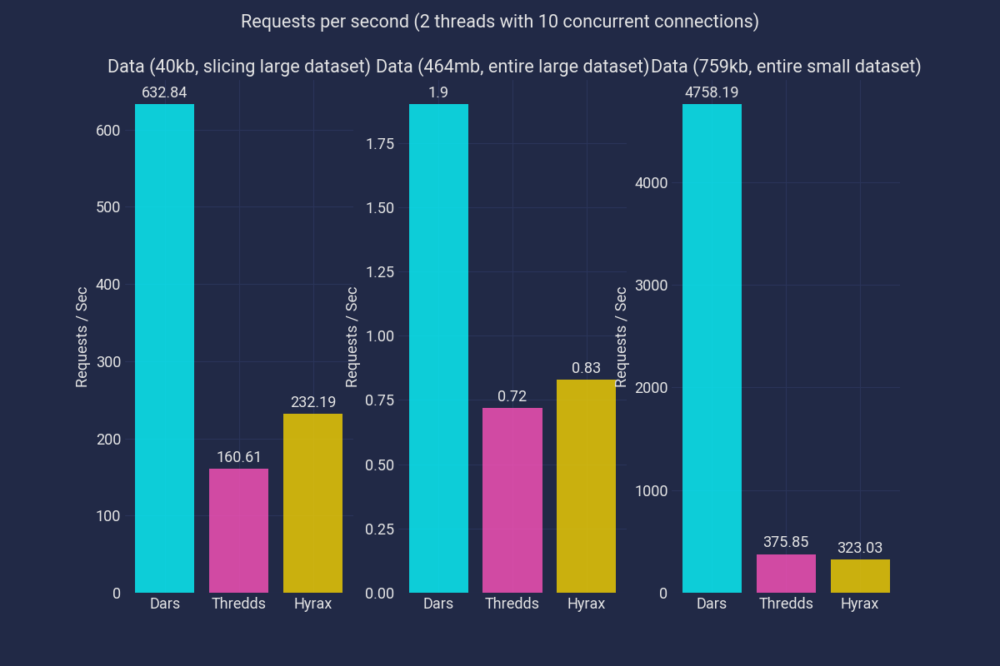
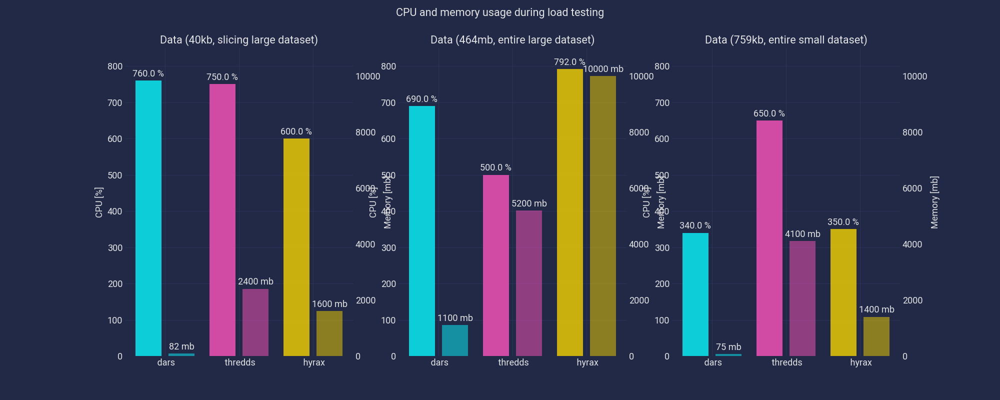

[](https://travis-ci.org/gauteh/dars)
[](https://hub.docker.com/r/gauteh/dars)
[](https://rust-lang.github.io/rustup/installation/other.html)

# 𓃢   DARS

DARS is an *asynchronous* _DAP/2_ server written in Rust aimed at being *fast* and *lightweight*. It supports a subset of the [OPeNDAP protocol](https://opendap.github.io/documentation/UserGuideComprehensive.html). It aims to only serve the `DAP` protocol, not common services like a catalog or a WMS.

See below for [installation instructions](#installation-and-basic-usage).

## OPeNDAP server implementation and file formats

Variable and hyperslab [constraints](https://opendap.github.io/documentation/UserGuideComprehensive.html#Constraint_Expressions), _except strides_, are implemented. File formats based on `HDF5` are supported:

* [HDF5](https://www.hdfgroup.org/solutions/hdf5/)
* [NetCDF](https://www.unidata.ucar.edu/software/netcdf/) (version 4)
* [NcML](https://www.unidata.ucar.edu/software/netcdf-java/current/ncml/Aggregation.html) (aggregation along existing dimension).

HDF5 is read through [hidefix](https://github.com/gauteh/hidefix), which is an
experimental HDF5 reader for concurrent reading.

## Some simple benchmarks

It is difficult to do meaningful benchmarks. However, here is an attepmt to
show a simple comparsion between Dars, Thredds and Hyrax. See
[comparsion/report.md](comparison/report.md) and
[comparison/benchmarks.sh](comparison/benchmarks.sh) for more details.
[wrk](https://github.com/wg/wrk) is used to measure the maximum requests per
second for a duration using 10 concurrent connections. For Thredds and the
large dataset [wrk2](https://github.com/giltene/wrk2) was used with a limit on
2 request/sec to avoid too many Out-of-memory-errors. The servers were run one
at the time using their default docker images. It would be interesting to show
latency [(hdr)histograms](http://hdrhistogram.org/) for the different tests,
but the performance (acceptable latency at certain requests per second) between
the servers is so different that it is difficult to make any meaningful plots.
Still, they should be included in further analysis, but done individiually for
each server.





It is also interesting to note that the server load was very different during these benchmarks:



# Installation and basic usage

Set up [rustup nightly](https://rust-lang.github.io/rustup/installation/other.html).

Running from the repository:

```sh
$ cargo run --release
```

or install with:

```sh
$ cargo install --path dars
```

By default a simple catalog can be explored using a browser, if the catalog is
disabled a list of datasets and DAP URLs can be queried at:
`http://localhost:8001/data/` (use `curl -Haccept:application/json
http://localhost:8001/data/` to get JSON). Use e.g. `ncdump -h http://..` to
explore the datasets.

## Docker

Use [gauteh/dars](https://hub.docker.com/r/gauteh/dars) or build yourself:

```sh
$ docker build -t dars .
$ docker run -it -p 8001:80 dars
```

mount your data at `/data`.

