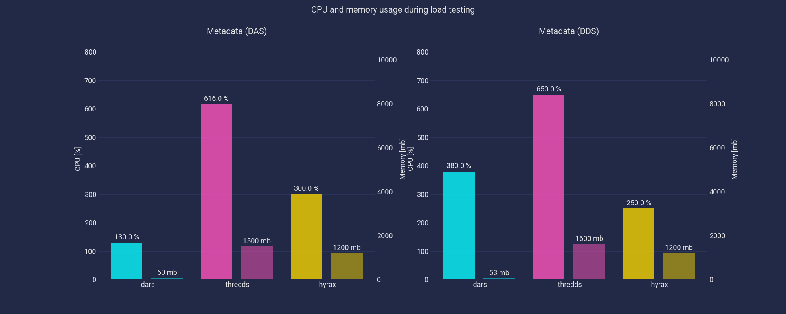

# Benchmark comparison of Dars with Thredds and Hyrax

The three servers are started in docker containers on the same machine (but not
at the same time). All the tests are run on each server sequentially, giving
the server some time to calm down between test. Since each test does the same
request multiple times we are measuring a warmed-up system. The servers are run
with maximum 6 cpus, leaving 2 for the benchmarking tool on the same machine
(not reserving cores for each will result in worse overall performance).
Network is run in host-mode.

## Criteria

These are the criteria the servers are compared on:

  * Errors
  * Maximum acceptable level of requests per seconds (will depend on response size)
  * Compare latency histograms under constant load at this level of requests between servers.

The acceptable level of requests per seconds, or the number of requests per
seconds a server can deliver without exhausting resources or encountering
errors will be very different. This makes it difficult to compare latency
between servers, and the first benchmarks will try to determine maximum
requests per seconds.

## Cases

The cases that will be compared are:

  * Fetch metadata (`.das` and `.dds`) for a dataset.
  * Fetch a small slice through an entire _large_ dataset (40 kb)
  * Fetch the entire large dataset (464 mb)
  * Fetch an entire smaller dataset (759 kb)

The large dataset is chunked, shuffled and compressed using zlib DEFLATE
(gzip), while the small dataset is chunked, but uncompressed.

# Requests per second

Ideally the latency at a given load (requests per second) should be shown. The
higher percentiles are the most interesting. However, the servers perform very
differently and latency is difficult to compare at the same number of requests
per seconds. First we therefore try to compare the maximum number of requests
per second. `wrk` is used to make as many requests as possible over _20
seconds_ with _10 concurrent_ connections and _2 threads_. The resource usage
is monitored using `docker stats`.

Note that `Thredds` experiences frequent `Out of memory`-errors during the
large dataset test. The requests had to be limited to 2 requests per second
(using `wrk2`), this still caused OOM-errors in the server log, but apparently
none that caused bad HTTP status codes.

## Resource usage

The test machine has 8 CPUs (max. 800% utilization) and about 31Gb memory. As
the tests above were run the CPU utilization and memory was read off `docker
stats`. They should be read with care. Especially memory is unreliable since
the allocator, and garbage collector, might release memory back to the system
at it's leisure. Memory might also appear high until some other program
requests more.

|           | CPU      | Memory    | PIDs  |
| :-------- | -------: | --------: | ----: |
| Thredds   | 0.1%     | 1.47GB    | 45    |
| Hyrax     | 0.1%     | 345MB     | 50    |
| Dars      | 0.02%    | 62MB      | 16    |
: CPU and memory load when server is idle

